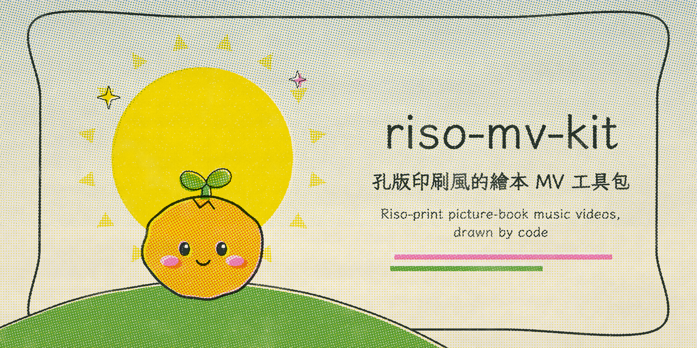
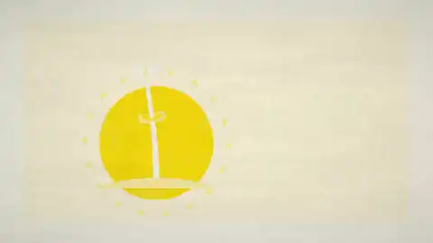
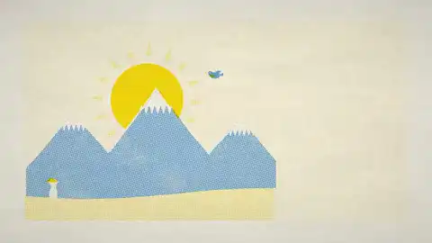

<p align="right"><a href="README.md">中文</a> · <b>English</b></p>

<p align="center">
  
</p>

<h1 align="center">riso-mv-kit</h1>

<p align="center"><em>Riso-print picture-book music videos, drawn by code</em></p>

<p align="center"></p>

Every frame is drawn by code, rendered one by one in headless Chrome, and joined with the music into a video.

Two MVs have been made with it so far; their storyboards and all of their scenes live in `projects/` as complete examples.

## Works

Highlights from both MVs, **without sound and without lyrics** (the songs and lyrics belong to their authors and are not in this repo). Click a picture for a sharper mp4.

<table>
<tr>
<td width="50%" valign="top"><a href="assets/previews/mebuki.mp4"></a></td>
<td width="50%" valign="top"><a href="assets/previews/tabibito.mp4"></a></td>
</tr>
<tr>
<td valign="top"><b>「芽吹の唄」</b> (Mushoku Tensei S3, second opening)<br>5:14. Two travellers in a paper world that sprouts: a country road, a clock-world, a whole field popping up on the downbeat.<br><a href="projects/mebuki/README.en.md">Storyboard and code →</a></td>
<td valign="top"><b>「旅人の唄」</b> (Mushoku Tensei S1 ending)<br>4:24. One traveller and a small bird: a mountain, a spring, an island above the clouds, a campfire dream, a pinky promise, lanterns.<br><a href="projects/tabibito/README.en.md">Storyboard and code →</a></td>
</tr>
</table>

## Features

- **Print texture**: every frame looks freshly printed, with separate ink drums, halftone screens at a different angle per ink, misregistration, uneven ink and paper fibre.
- **Hand-drawn rhythm**: drawings change 12 times a second (animation "on twos") and their lines wobble a little each time; camera moves and lyrics stay smooth at 30 fps.
- **Follows the music**: scenes are scheduled in bars, page turns land on the bar line that starts a phrase, seedlings open on the downbeat and the characters walk in time.
- **Lyric typesetting**: Japanese runs vertically and prints glyph by glyph as it is sung, with a Chinese subtitle underneath. A paper-white halo keeps the text readable on any background.
- **No external art**: characters, plants, skies, roads, rain and light are all drawn by code, with no AI image generation and no stock assets. Even the repo icon is printed by the same engine (`projects/_brand/`).

## Quick start

Requires macOS (or Linux), Node.js 18+, Google Chrome and ffmpeg (`brew install ffmpeg`).

```bash
npm install
```

```bash
node tools/server.mjs
```

Keep the server running, then open:

- The template project: <http://localhost:8766/studio.html?project=_template&play> (click the page to start)
- One frame: `studio.html?project=_template&t=12`
- One scene on its own: `studio.html?project=_template&scene=sc_rainy&t=3`

## Making a new MV

```bash
./tools/new_project.sh my-song
```

Put the song at `projects/my-song/audio/song.mp3` and the lyrics in `projects/my-song/lyrics.txt`, then:

1. **Tempo**: `node tools/analyze.mjs my-song` writes the bpm and first downbeat to `song.json`, checks the beat grid for drift, and prints an energy curve that shows where the sections change.
2. **Lyric timing**: use one of these:
   - the tap tool `timing.html?project=my-song`: hold space while each line is sung
   - `tools/video-lyric-scan.js`: reads subtitle changes from a lyric video of the same recording
   - edit `timing.json` by hand

   Then run `node tools/make_lyrics.mjs my-song`.
3. **Storyboard and scenes**: `story.js` says which scene starts at which bar or lyric line. `scenes.js` draws them, using the building blocks in `engine/kit.js` or scenes copied from `projects/mebuki/`.
4. **Preview**: `studio.html?project=my-song&play`
5. **Render**: `./tools/render_chunks.sh my-song` renders, encodes and deletes frames in chunks so a full song never fills the disk. It writes `video/my-song.mp4` and a smaller `video/my-song_share.mp4`.

To show your own work in a README, `tools/make_preview.sh` renders just the time ranges you pick, with the lyrics switched off and no music, and writes an mp4 plus an animated webp that are safe to commit.

Step by step: **[docs/WORKFLOW.en.md](docs/WORKFLOW.en.md)**. How every technique works: **[docs/TECHNIQUES.en.md](docs/TECHNIQUES.en.md)**, covering the print engine, halftones, misregistration, animating on twos, seedling growth, the pseudo-3D road, vertical lyrics, page turns, the pencil fade, memory cards, tempo and vocal analysis, and reading timing from lyric videos.

## Layout

| Path | What it is |
|---|---|
| `engine/` | Shared engine: `riso.js` printing, `draw.js` picture-book shapes, `plant.js` seedlings, `road.js` road, `type.js` lyrics, `transitions.js` page turn, `timeline.js` scheduling, `kit.js` scene building blocks |
| `projects/NAME/` | One MV: `song.json` settings, `timing.json` lyric times, `story.js` storyboard, `scenes.js` scenes |
| `projects/_template/` | Starter project |
| `projects/mebuki/` | The 「芽吹の唄」 example |
| `projects/tabibito/` | The 「旅人の唄」 example (a single lead, timing from speech recognition) |
| `projects/_brand/` | The repo icon and social preview (rebuild with `tools/make_brand.sh`) |
| `assets/previews/` | Highlights of the works (silent, no lyrics; made with `tools/make_preview.sh`) |
| `tools/` | Server, renderer, chunked render, encode, highlight previews, tempo and vocal analysis, lyric tools, lyric-video scan |
| `studio.html` | Preview and render page |
| `timing.html` | Tap-along lyric timing tool (English / Chinese interface) |

## Copyright

Songs, lyrics and translations belong to their authors and are **never** committed: `projects/*/audio/`, `lyrics.txt`, `lyrics.json` and every render output are in `.gitignore`. The example projects keep only code and numeric timings; the highlights in `assets/previews/` were rendered separately with the lyrics off and no music. To rebuild it you need your own legally obtained recording and lyrics. Check the rights before publishing a video that uses someone else's work.

## Credits and license

ISC License. The render-in-Chrome-then-encode-with-FFmpeg approach comes from [2606156052/Pdoom-video-anime-version](https://github.com/2606156052/Pdoom-video-anime-version) (ISC) and [JohnHeibel/PDoomVideo](https://github.com/JohnHeibel/PDoomVideo) (ISC as declared in its package.json); their notices are kept in [LICENSE](LICENSE). The engine, scenes and tools were made by Claude (Anthropic) together with malilion. Fonts: Klee One and LXGW WenKai TC from Google Fonts (SIL OFL).
